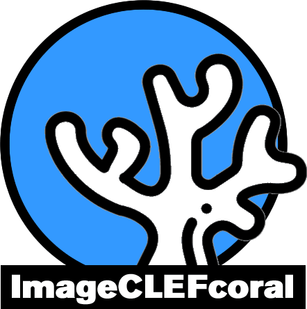
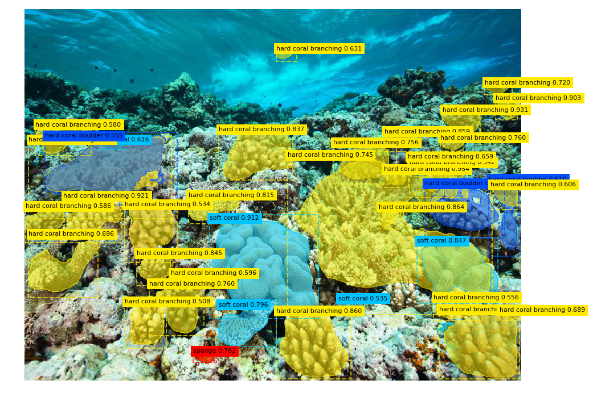
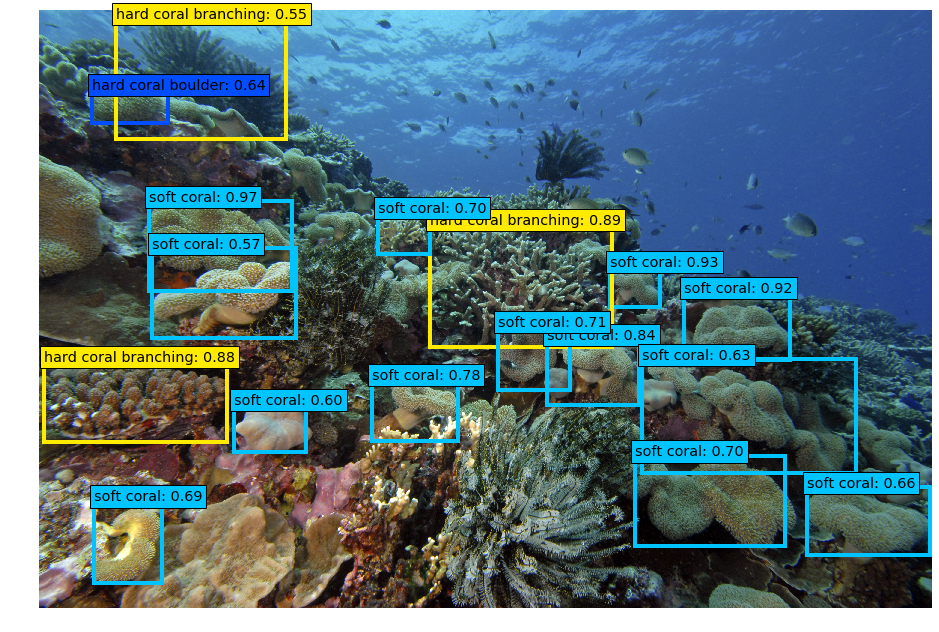

# CoralClef2020
Object detection in an Image using Neural network

[ImageCLEF 2020 Coral](https://www.imageclef.org/2020/coral)

## Mask R-CNN
original repository - [https://github.com/matterport/Mask_RCNN](https://github.com/matterport/Mask_RCNN)
- MRCNN_training_coral - Pro trénování modelu je nejdříve potřeba stáhnout [předtrénované váhy](https://github.com/matterport/Mask_RCNN/releases/download/v2.0/mask_rcnn_coco.h5) poskytované autory. Po stažení a umístění vah do požadované složky je možné spuštěním kódu model trénovat. Při přerušení trénování a opětovném spuštění je potřeba upravit část kódu, postup je popsaný v komentářích v kódu.
- Mask_RCNN_evaluate_coral - Provede detekci a uloží výsledky potřebné pro evaluaci, výpočet je proveden pomocí [mAP](mAP/).
- Mask_RCNN_inference_coral - Může provést detekci na jednotlivých obrázcích, nebo validační/trénovací množině. 
- Mask_RCNN_test_coral - Kód pro detekci na testovací množině. Provede detekci a uloží výsledky ve formátu požadovaném pro odevzdání.

## SSD
original repository - [https://github.com/pierluigiferrari/ssd_keras](https://github.com/pierluigiferrari/ssd_keras)
- ssd512_training_coral - Pro trénování modelu je nejdříve potřeba stáhnout [předtrénované váhy](https://drive.google.com/file/d/1IJWZKmjkcFMlvaz2gYukzFx4d6mH3py5/view) poskytované autory.  Po stažení a umístění vah do požadované složky je možné spuštěním kódu model trénovat. Při přerušení trénování a opětovném spuštění je potřeba upravit část kódu, postup je popsaný v komentářích v kódu.
- weight_sampling_coral - Stažené předtrénované váhy jsou trénovány na datasetu MS COCO, který má 80 tříd. Dataset CoralClef má pouze 13 tříd, výstup modelu by tedy neodpovídal. Tento kód odstraní přebytečné části výstupu.
- ssd512_evaluation_coral - Provede detekci a uloží výsledky potřebné pro evaluaci, výpočet je proveden pomocí [mAP](mAP/).
- ssd512_inference_coral - Může provést detekci na jednotlivých obrázcích, nebo validační/trénovací množině.
- ssd512_test_coral - Kód pro detekci na testovací množině. Provede detekci a uloží výsledky ve formátu požadovaném pro odevzdání.

## mAP
original repository - [https://github.com/Cartucho/mAP](https://github.com/Cartucho/mAP)

Kód použitý pro evaluaci obou modelů. Výsledky detekce a graund truth data musejí být uloženy ve složce input, pro každý obrázek musí být uložen soubor zvlášť. Výsledky jsou pak ve složce output. Výpočet je proveden spuštěním hlavního souboru `python main.py`.

## ostatni
- flip_img - Některé obrázky v datasetu jsou vzhledem k anotacím otočené o 180° a je potřeba je otočit.
- save_to_json - Převedení poskytnutých anotací do formátu MS COCO.
- draw_bb - Ilustrační zobrazení rámečků v obrázcích.
- augmentations - Vygeneruje augmentované obrázky a soubor s novými anotacemi z původního datasetu a anotací vytvořených pomocí [save_to_json.py](ostatni/save_to_json.py). 
- split_dataset - Rozdělí dataset na validační a trénovací množinu v zadaném poměru. Obrázky jsou rozděleny podle instancí tříd, které obsahují, tak aby se v každé množině vyskytovali v zadaném poměru. To může způsobit, že výsledný poměr bude vyšší než zadaný. První část rozdělí neaugmentovaná data, druhá část pak přiřadí augmentované obrázky do množiny ve které je originální obrázek. Vstupem je soubor s anotacemi ve formátu MS COCO, případně soubor s augmentovanými anotacemi, výstupem je soubor s anotacemi pro validační a soubor s anotacemi pro trénovací množinu.

## Požadavky
Modely fungují s následujícími verzemi balíčků:  
`tensorflow-gpu = 1.3.1`  
`keras = 2.2.5`  
Další potřebné balíčky jsou v souboru [requirements.txt](requirements.txt)  
Dále je potřeba `CUDA = 10.0` při použití gpu verze tensorflow.  
